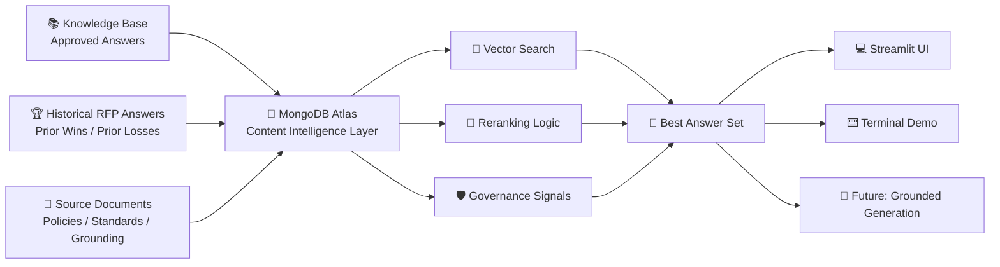
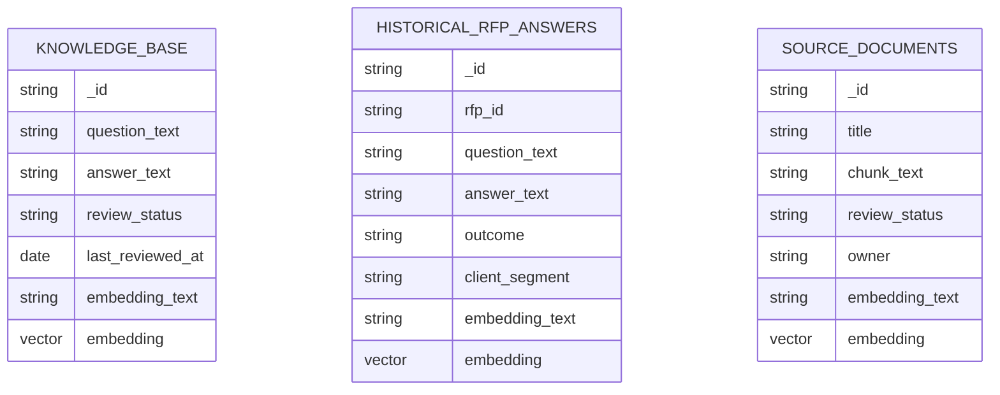
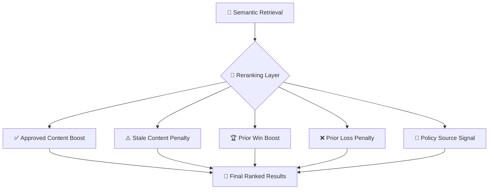
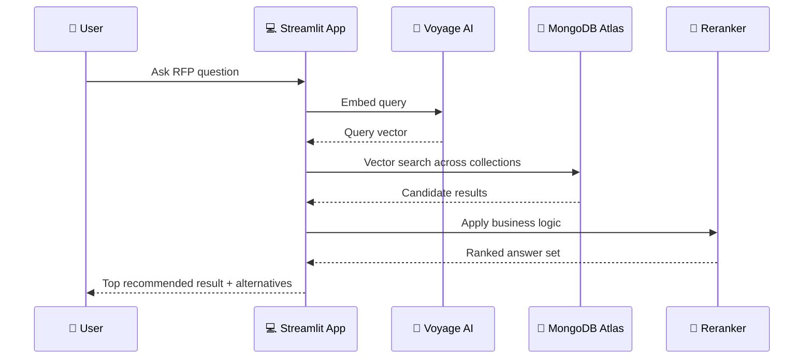

# 🚀 RFP Intelligence System

> **Select the best answer before AI generates anything.**

An interactive demo showing why **MongoDB is the intelligence layer** for enterprise RFP workflows.

Instead of asking an LLM or copilot to guess from scattered content, this system:

- pulls from multiple enterprise content sources
- understands the intent of an RFP question
- ranks results using both semantic relevance and business signals
- returns the **best answer set before generation**

---

## ✨ Why this exists

Most teams have:
- a content repository
- a workflow tool
- an AI drafting tool

What they usually **don’t** have is the layer in between:

> the system that decides **which answer should be used**

That’s what this demo is built to show.

---

## 🧠 Core idea

**Qvidian stores answers. Copilot generates answers. MongoDB decides which answers should be used.**

This project demonstrates how MongoDB can act as a cross-system **content intelligence layer** by combining:

- 📚 approved knowledge base content
- 🏆 historical winning RFP answers
- 📄 policy / source documents

...and ranking them into a trusted answer set.

---

## 🏗️ Architecture



---

## 🔥 What the system does

Given an RFP question like:

> *Describe your HIPAA compliance controls and audit process.*

The system:

1. embeds the query with **Voyage AI**
2. runs **MongoDB Atlas Vector Search** across multiple collections
3. retrieves semantically relevant answers and source docs
4. reranks them with business logic:
   - ✅ approved > stale
   - 🏆 won > lost
   - 📄 policy grounding gets surfaced
5. presents a ranked answer set to the user

---

## 🧩 Collections used in the demo



---

## ⚙️ How ranking works

Vector search gets the system **semantic relevance**.

Then reranking adds **business meaning**.

### Example scoring logic

- `approved` → boost
- `stale` → penalty
- `won` → boost
- `lost` → penalty
- `policy source` → surfaced as grounding



---

## 🖥️ Demo modes

This repo includes two flavors of the same idea:

### 1. `rfp_engine_terminal.py`
Old-school terminal output with a ranked result list.

Best for:
- technical audiences
- debugging
- showing the selection engine clearly

### 2. `app.py`
A Streamlit UI for interactive demos.

Best for:
- leadership demos
- customer storytelling
- showing this as a product experience

---

## 🛠️ Tech stack

- 🍃 **MongoDB Atlas**
  - document model
  - vector search
  - unified data layer
- 🌊 **Voyage AI**
  - `voyage-4-large`
  - 1024-dim embeddings
- 🎈 **Streamlit**
  - lightweight demo UI
- 🐍 **Python**
  - query orchestration
  - reranking logic

---

## 📂 Project structure

```text
.
├── app.py
├── rfp_engine_terminal.py
├── embedder.py
├── answerTest.py
├── nextLevel.py
├── README.md
```

---

## 🚦 Getting started

### 1. Install dependencies

```bash
pip install pymongo voyageai streamlit
```

### 2. Set up your MongoDB Atlas collections

Create and load:

- `knowledge_base`
- `historical_rfp_answers`
- `source_documents`

Each document should include:
- `embedding_text`
- `embedding`

### 3. Create vector indexes

Create an Atlas Vector Search index on each collection:

- index name: `vector_index`
- path: `embedding`
- dimensions: `1024`
- similarity: `cosine`

Example index definition:

```json
{
  "fields": [
    {
      "type": "vector",
      "path": "embedding",
      "numDimensions": 1024,
      "similarity": "cosine"
    }
  ]
}
```

### 4. Add your credentials

In your scripts:

```python
MONGODB_URI = "YOUR_MONGODB_ATLAS_URI"
DB_NAME = "RFP_Demo"
VOYAGE_API_KEY = "YOUR_VOYAGE_API_KEY"
```

### 5. Run the Streamlit app

```bash
streamlit run app.py
```

---

## 🧪 Example demo questions

```text
Describe your HIPAA compliance controls and audit process
How do you protect sensitive customer data?
Describe your audit and monitoring practices
What compliance frameworks do you align to?
Describe your compliance governance structure
How do you ensure regulatory compliance and data protection?
How do you ensure PHI is protected and continuously audited?
```

---

## 🎯 What this demo proves

This is **not** just “AI search.”

This is a working example of:

- semantic retrieval across multiple content sources
- business-aware reranking
- explainable answer selection
- grounding before generation

In other words:

> **AI features are not enough.**
>
> Enterprise RFP workflows need a system that selects the right answer first.

---

## 🪄 Future enhancements

- 🤖 Generate final grounded draft from top-ranked results
- 📊 Add confidence bars and freshness indicators
- 🧾 Show citations / provenance inline
- 🧠 Feedback loop to learn from accepted answers
- 🔐 Add role-based filtering by business unit or content type

---

## 📸 Demo flow



---

## 💥 The punchline

**Without MongoDB:**
- AI drafts from scattered content
- humans still hunt, compare, validate, and guess

**With MongoDB:**
- best answers are selected first
- AI is grounded in trusted content
- the workflow gets smarter over time

---

## 🏁 TL;DR

> **MongoDB is not just where the data lives.**
>
> **MongoDB is the layer that makes the answer trustworthy.**

---

## 🙌 Built for demoing the difference between:
- “we have AI”
- and
- “we have an intelligence layer”
